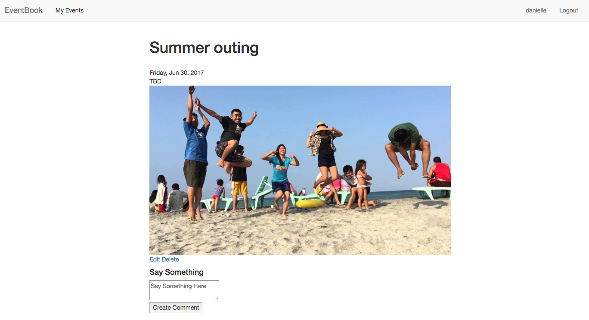

## EventBook
  
  

### EventBook is a place to keep your memories and share the experience. 

<!--  -->

### User logs in and creates an event, documents the details and adds an image. Connects with friends to relive the expereince or creates an event for the future. 

### Trello, Wireframe and ERD

<a href= "https://trello.com/b/BegP0Rjo/eventbook">Trello</a>

### EventBook

<a href= "https://salty-garden-61134.herokuapp.com/login">EventBook</a> 

## Development and Technologies
### Ruby on Rails, Bootstrap, HTML, CSS, and JavaScript.

## MVP
-  Full CRUD.  
-  Three working Models.
-  Ability to Sign-Up/In/Out.
-  Comment on Events, and Update/Delete both.
-  Bootstrap design implementation.

## Still to come.
-  AWS, Paperclip image upload implementation.
-  Add friends and link to friends.
-  Sexy styling.
-  User profile page with in depth input fields.

